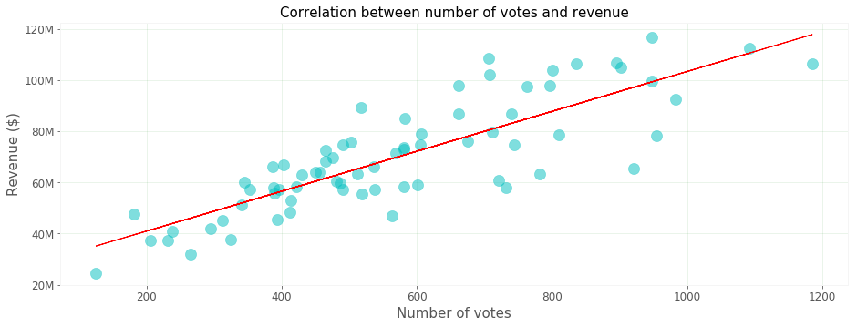
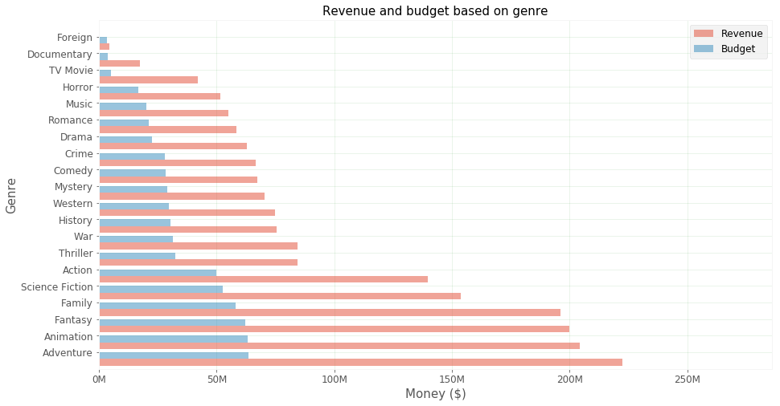
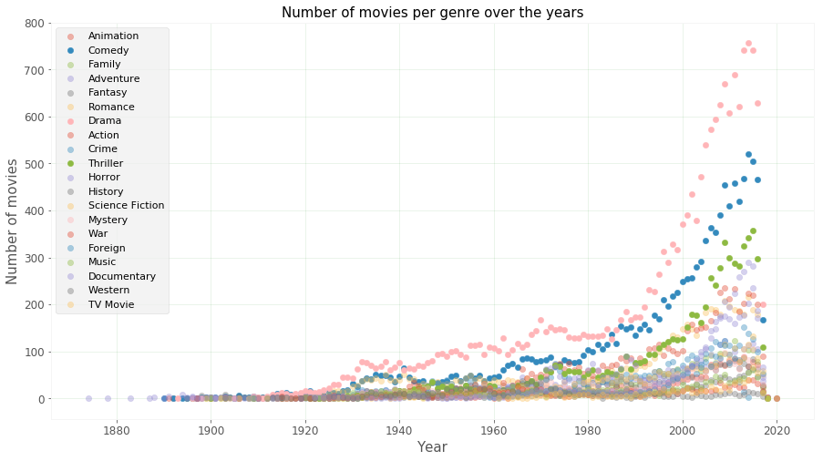
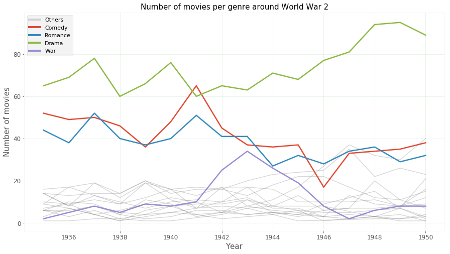
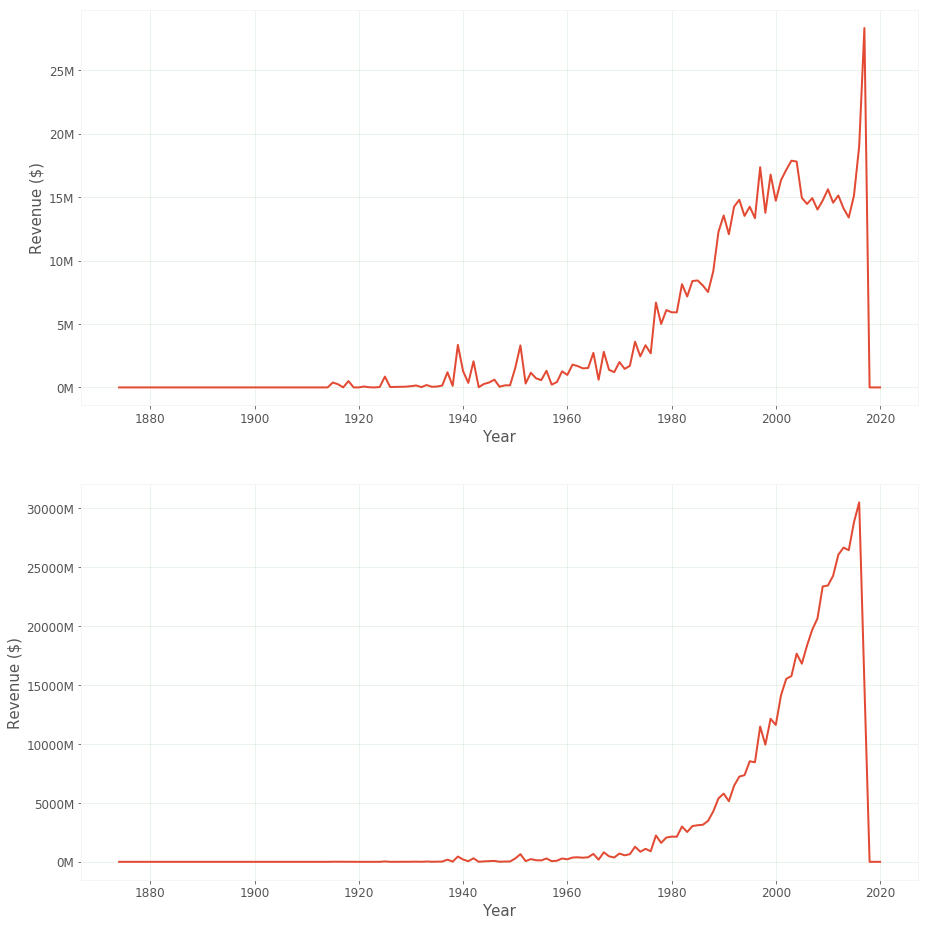
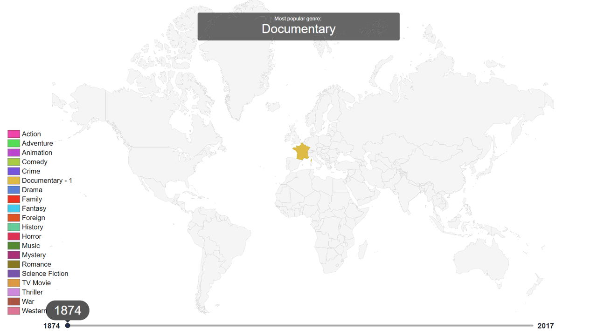

# Sodelujoči
- [Domen Dolanc](https://github.com/DomenDolanc)
- [Tomaž Martinčič](https://github.com/tm1897)
- [Žiga Klopčič](https://github.com/klopcic)

# Povezave
- [Osnutek](osnutek.md)
- [Google Drive folder](https://drive.google.com/drive/folders/1vcHoJ-GEajEp0izntpg250MWi18bjNda?usp=sharing)

------------------

# Cilj raziskave
Analiza filmov in napovedovanje njihove uspešnosti.
Vizualno bomo predstavili rezultate naše raziskave v kateri bomo odgovorili na spodnja vprašanja:

- Kakšen je vpliv ekipe filma na njegovo uspešnost?
- Kaj vse vpliva na uspešnost filma?
- Analiza vložka in dobička glede na žanr.
- Analiza vložka in dobička glede na čas.

V sklopu naše raziskave bomo naredili aplikacijo, ki bo poizkušala napovedovati uspešnost filma. Pripravili bomo tudi animacijo, ki bo prikazovala popularnost žanrov na zemljevidu skozi čas.

#### Uporabljene knjižnice

- Orange
- collections
- matplotlib
- numpy
- json
- pandas
- dateutil

Na spodnji sliki je prikazana korelacija med prihodkom in številom ocen.

Spodnja slika prikazuje proračun in prihodki za posamezen žanr.

Spodnja slika prikazuje število filmov prikazanega žanra skozi leta.

Število filmov posameznega žanra v obdobju 2. svetovne vojne.

Spodnji sliki prikazujeta vsoto in povprečje prihodkov skozi čas.

Zemljevid, ki prikazuje njabolj snemane žanre v državi za vsako leto:

Druge hitrosti:

- [0.2s zamik](readme_images/map-0.2s-delay.gif)
- [2s zamik](readme_images/map-2s-delay.gif)